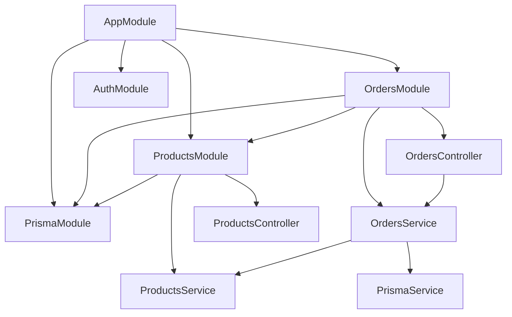
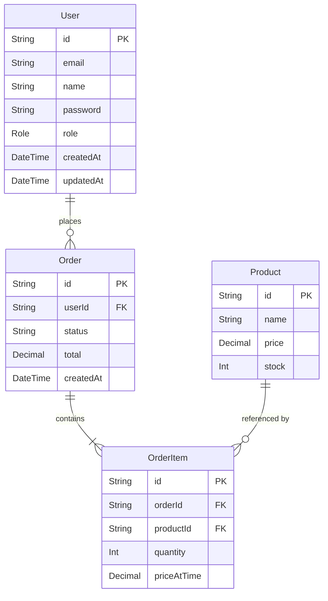
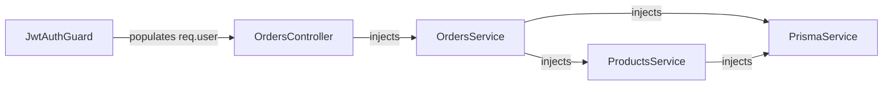
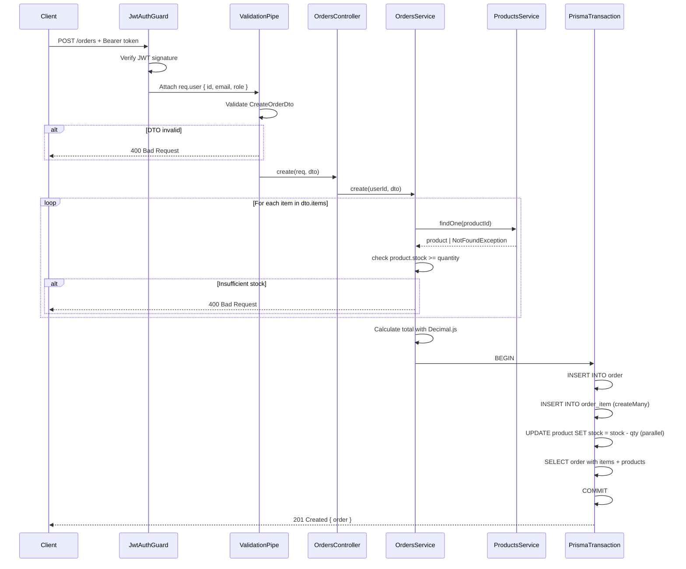
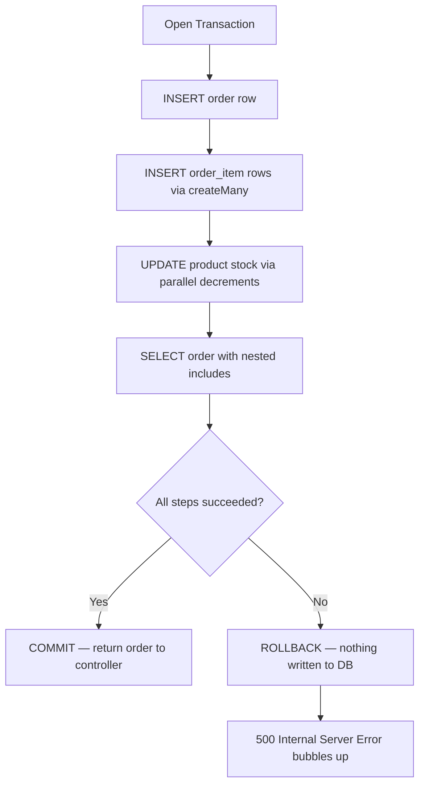
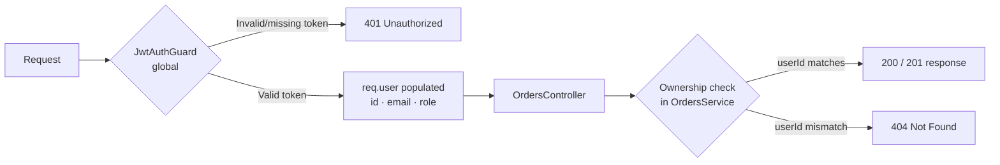
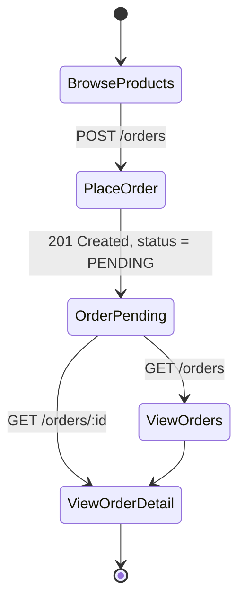
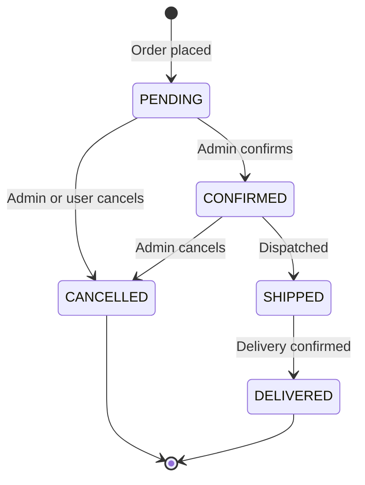
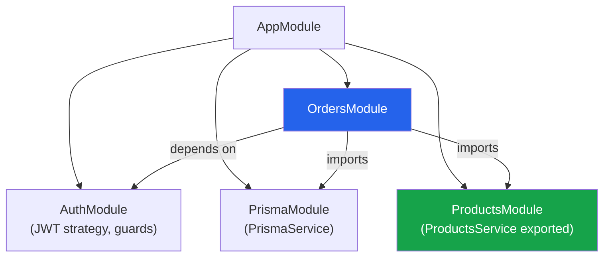

# Orders Module — Technical Documentation

> **Project:** NestJS E-Commerce API  
> **Module:** `src/orders/`  
> **Author:** Generated during development session — May 23, 2026  
> **Stack:** NestJS 10 · TypeScript 5.9 · Prisma 7 · PostgreSQL · Decimal.js

---

## Table of Contents

1. [Overview](#1-overview)
2. [Module Architecture](#2-module-architecture)
3. [File Structure](#3-file-structure)
4. [Database Schema](#4-database-schema)
5. [Dependency Injection Graph](#5-dependency-injection-graph)
6. [API Endpoints](#6-api-endpoints)
7. [Request Lifecycle — POST /orders](#7-request-lifecycle--post-orders)
8. [Transaction Design](#8-transaction-design)
9. [Decimal & Price Safety](#9-decimal--price-safety)
10. [Pagination](#10-pagination)
11. [Error Handling](#11-error-handling)
12. [Authentication & Authorization](#12-authentication--authorization)
13. [DTOs & Validation](#13-dtos--validation)
14. [User-Side Order Management](#14-user-side-order-management)
15. [Admin-Side Order Management](#15-admin-side-order-management)
16. [Integration With Other Modules](#16-integration-with-other-modules)
17. [Extending the Module](#17-extending-the-module)
18. [Environment & Configuration](#18-environment--configuration)

---

## 1. Overview

The Orders module is the transactional core of the e-commerce API. It is responsible for:

- Accepting order placement requests from authenticated users
- Validating product existence and stock availability **before** any write occurs
- Capturing the product price **at the time of purchase** (`priceAtTime`) so historical order records remain accurate even if a product's price changes later
- Executing order creation, order item insertion, and stock decrement inside a **single atomic Prisma transaction** — if any step fails the entire operation is rolled back
- Exposing paginated order history scoped strictly to the requesting user
- Enforcing ownership on every read so users can never access another user's orders

---

## 2. Module Architecture



### Why `ProductsModule` is imported into `OrdersModule`

NestJS modules are encapsulated by default — a service defined in `ProductsModule` is not visible outside it unless explicitly exported. The `exports: [ProductsService]` line added to `ProductsModule` makes `ProductsService` available to any module that imports `ProductsModule`. `OrdersModule` imports it so `OrdersService` can call `productsService.findOne()` during stock validation without duplicating any database logic.

---

## 3. File Structure

```
src/
├── orders/
│   ├── dto/
│   │   ├── create-order.dto.ts       # Payload shape + validation for POST /orders
│   │   └── pagination-query.dto.ts   # ?page and ?limit query params
│   ├── orders.controller.ts          # Route handlers, extracts req.user
│   ├── orders.module.ts              # Module declaration, imports, DI wiring
│   └── orders.service.ts             # All business logic and DB operations
│
├── products/
│   └── products.module.ts            # MODIFIED — added exports: [ProductsService]
│
├── prisma/
│   ├── prisma.module.ts              # Global Prisma module (pre-existing)
│   └── prisma.service.ts             # Wraps PrismaClient (pre-existing)
```

---

## 4. Database Schema

The Orders module interacts with three Prisma models.



### Field notes

| Field | Type | Notes |
|---|---|---|
| `Order.id` | `String @db.Uuid` | Auto-generated via `gen_random_uuid()` in PostgreSQL |
| `Order.status` | `String` | Defaults to `"PENDING"`. See [Admin-Side Management](#15-admin-side-order-management) for status lifecycle |
| `Order.total` | `Decimal @db.Decimal(10,2)` | Calculated server-side using Decimal.js — never trusted from the client |
| `OrderItem.priceAtTime` | `Decimal @db.Decimal(10,2)` | Snapshot of `Product.price` at the moment of purchase. Immutable after creation |
| `OrderItem` cascade | `onDelete: Cascade` | Deleting an `Order` automatically deletes all its `OrderItem` rows |
| `Product.stock` | `Int` | Decremented atomically inside the transaction via Prisma's `{ decrement: quantity }` |

---

## 5. Dependency Injection Graph



NestJS resolves this graph at bootstrap time. If any dependency is missing (e.g. `ProductsModule` not imported, or `ProductsService` not exported), the application throws a `Nest can't resolve dependencies` error at startup — not at runtime.

---

## 6. API Endpoints

| Method | Path | Auth | Description |
|---|---|---|---|
| `POST` | `/orders` | JWT required | Place a new order |
| `GET` | `/orders` | JWT required | Get paginated order history for the logged-in user |
| `GET` | `/orders/:id` | JWT required | Get a single order with items. Returns 404 if not owned by caller |

### POST /orders

**Request body:**
```json
{
  "items": [
    { "productId": "uuid-v4-string", "quantity": 2 },
    { "productId": "uuid-v4-string", "quantity": 1 }
  ]
}
```

**Success response — 201 Created:**
```json
{
  "id": "order-uuid",
  "userId": "user-uuid",
  "status": "PENDING",
  "total": "389.97",
  "createdAt": "2026-05-23T14:43:00.000Z",
  "items": [
    {
      "id": "item-uuid",
      "orderId": "order-uuid",
      "productId": "product-uuid",
      "quantity": 2,
      "priceAtTime": "129.99",
      "product": {
        "id": "product-uuid",
        "name": "Mechanical Keyboard",
        "price": "129.99",
        "stock": 48
      }
    }
  ]
}
```

### GET /orders

**Query params:**

| Param | Type | Default | Description |
|---|---|---|---|
| `page` | integer ≥ 1 | `1` | Page number |
| `limit` | integer ≥ 1 | `10` | Items per page |

**Success response — 200 OK:**
```json
{
  "data": [ /* array of orders with nested items */ ],
  "pagination": {
    "total": 42,
    "page": 1,
    "limit": 10,
    "totalPages": 5
  }
}
```

### GET /orders/:id

**Success response — 200 OK:** Single order object with nested `items[]` each containing nested `product`.

---

## 7. Request Lifecycle — POST /orders



---

## 8. Transaction Design

The entire write path for order creation is wrapped in `prisma.$transaction(async (tx) => { ... })`. This means all four operations — order insert, order items insert, stock decrements, and final read — either all succeed or all roll back.



### Why parallel decrements are safe

Each `product.update` targets a different `productId`. There are no two operations in the parallel batch touching the same row, so there is no risk of a write conflict within the transaction. PostgreSQL row-level locking handles concurrent requests from different users ordering the same product correctly.

### Why the final SELECT is inside the transaction

The `order.findUnique` with full includes is executed inside the same transaction context (`tx`) rather than on the main `prisma` client. This guarantees that the response body reflects exactly what was committed — not a dirty read from a parallel request.

---

## 9. Decimal & Price Safety

PostgreSQL `DECIMAL(10,2)` fields are returned by Prisma as `Decimal.js` objects, not JavaScript `number` primitives. This is intentional — JavaScript's `number` type uses IEEE 754 floating point, which cannot represent all decimal fractions exactly (e.g. `0.1 + 0.2 === 0.30000000000000004`). For financial data this is unacceptable.

The service handles this as follows:

```typescript
// product.price is a Decimal.js object from Prisma
const lineTotal = new Decimal(product.price.toString()).mul(quantity);
const total = resolvedItems.reduce((sum, { product, quantity }) => {
  return sum.plus(new Decimal(product.price.toString()).mul(quantity));
}, new Decimal(0));
```

**Rules enforced:**
- `.toString()` is always called before constructing a new `Decimal()` to avoid implicit coercion
- Accumulation uses `.plus()` — never the `+` operator
- Before writing to Prisma, `.toDecimalPlaces(2).toNumber()` serialises to a two-decimal-place number
- `priceAtTime` is always snapshotted from the resolved product, never accepted from the client payload

---

## 10. Pagination

`GET /orders` uses offset pagination. The implementation issues two queries inside a `$transaction` to guarantee the count and data are consistent with each other:

```typescript
const [data, total] = await this.prisma.$transaction([
  this.prisma.order.findMany({ where: { userId }, skip, take: limit, ... }),
  this.prisma.order.count({ where: { userId } }),
]);
```

**Formula:**

| Variable | Formula |
|---|---|
| `skip` | `(page - 1) * limit` |
| `totalPages` | `Math.ceil(total / limit)` |

**Response envelope** (always returned even when `data` is empty):
```json
{
  "data": [],
  "pagination": {
    "total": 0,
    "page": 1,
    "limit": 10,
    "totalPages": 0
  }
}
```

---

## 11. Error Handling

All errors follow NestJS's built-in HTTP exception pattern and are handled by the global exception filter already active in the application.

| Scenario | Exception | HTTP Status |
|---|---|---|
| JWT missing or invalid | `UnauthorizedException` (from JwtAuthGuard) | 401 |
| DTO validation failure | `ValidationException` (from ValidationPipe) | 400 |
| `productId` is not a valid UUID format | `BadRequestException` (from ParseUUIDPipe) | 400 |
| Product ID does not exist in DB | `NotFoundException` (thrown by ProductsService.findOne) | 404 |
| Product stock < requested quantity | `BadRequestException` (thrown by OrdersService) | 400 |
| Order ID does not exist | `NotFoundException` (thrown by OrdersService.findOne) | 404 |
| Order exists but belongs to another user | `NotFoundException` — **intentionally not 403** | 404 |
| Transaction failure / DB error | Unhandled — bubbles to global filter | 500 |

### Security note on 404 vs 403

When a user requests `GET /orders/:id` for an order that exists but belongs to another user, the service returns `404 Not Found` rather than `403 Forbidden`. A `403` would confirm that the order ID exists in the system, leaking information. The `404` response is indistinguishable from a genuinely missing order.

---

## 12. Authentication & Authorization



The global `JwtAuthGuard` is already active across the entire application — no `@UseGuards()` decorator is needed on the `OrdersController`. Every request that reaches the controller is guaranteed to have a valid `req.user` object with `{ id, email, role }`.

**Role-based access** is not currently implemented in this module. All authenticated users have equal access to the order endpoints, scoped to their own data. See [Admin-Side Order Management](#15-admin-side-order-management) for how to extend this.

---

## 13. DTOs & Validation

### CreateOrderDto

```
src/orders/dto/create-order.dto.ts
```

| Field | Decorator | Rule |
|---|---|---|
| `items` | `@IsArray` | Must be an array |
| `items` | `@ArrayMinSize(1)` | At least one item required |
| `items` | `@ValidateNested({ each: true })` | Recursively validate each OrderItemDto |
| `items` | `@Type(() => OrderItemDto)` | Required by class-transformer for nested validation |
| `items[].productId` | `@IsUUID('4')` | Must be a valid v4 UUID |
| `items[].quantity` | `@IsInt` | Must be a whole number |
| `items[].quantity` | `@Min(1)` | Must be at least 1 |

### PaginationQueryDto

```
src/orders/dto/pagination-query.dto.ts
```

| Field | Decorator | Default | Rule |
|---|---|---|---|
| `page` | `@IsOptional @IsInt @Min(1)` | `1` | Page number |
| `limit` | `@IsOptional @IsInt @Min(1)` | `10` | Items per page |

`@Type(() => Number)` is applied to both fields because query parameters arrive as strings from the HTTP layer — class-transformer coerces them to numbers before class-validator runs.

---

## 14. User-Side Order Management

From an end-user perspective, the module exposes a complete read and write flow:



**What a user can do:**

- **Place an order** — `POST /orders` with an array of `{ productId, quantity }` items. The server validates stock, calculates the total, and returns the full order object including all items and current product details.
- **List their orders** — `GET /orders?page=1&limit=10` returns only their own orders, newest first, with full item details nested.
- **View a specific order** — `GET /orders/:id` returns the full order detail. If the ID doesn't belong to them it returns 404.

**What a user cannot do (current implementation):**

- Cancel an order (no `DELETE /orders/:id` or status update endpoint exists yet)
- Modify an order after placement
- See another user's orders

---

## 15. Admin-Side Order Management

The current implementation does **not** include admin-specific endpoints. This section documents the intended extension points for future maintainers.

### Order status lifecycle



The `Order.status` field is currently a plain `String` defaulting to `"PENDING"`. To implement the full lifecycle:

**Step 1** — Convert `status` to a Prisma enum in `schema.prisma`:
```prisma
enum OrderStatus {
  PENDING
  CONFIRMED
  SHIPPED
  DELIVERED
  CANCELLED
}
```

**Step 2** — Add an `UpdateOrderStatusDto`:
```typescript
export class UpdateOrderStatusDto {
  @IsEnum(OrderStatus)
  status: OrderStatus;
}
```

**Step 3** — Add a `PATCH /orders/:id/status` endpoint restricted to `ADMIN` role:
```typescript
@Patch(':id/status')
@Roles('ADMIN')
@UseGuards(RolesGuard)
updateStatus(
  @Param('id', new ParseUUIDPipe({ version: '4' })) id: string,
  @Body() dto: UpdateOrderStatusDto,
) {
  return this.ordersService.updateStatus(id, dto.status);
}
```

**Step 4** — Add a `GET /admin/orders` endpoint that returns all orders across all users (without the `userId` filter), still paginated.

### Stock on cancellation

When an order is cancelled, stock should be restored. The service method must:
1. Fetch the order items to know quantities
2. Run a transaction that updates status to `CANCELLED` and increments each product's stock by the cancelled quantity

---

## 16. Integration With Other Modules



### AuthModule

`OrdersModule` does not import `AuthModule` directly. The global `JwtAuthGuard` registered in `AuthModule` intercepts every request application-wide before it reaches `OrdersController`. The controller only reads `req.user` which the guard has already populated.

### PrismaModule

`PrismaModule` is imported so that `PrismaService` can be injected into `OrdersService`. The same `PrismaService` singleton is shared across all modules that import `PrismaModule` — there is only ever one database connection pool.

### ProductsModule

`ProductsModule` is imported (and `ProductsService` is exported from it) so `OrdersService` can call `productsService.findOne(id)` to validate product existence and read current stock and price. This avoids duplicating any product-fetching logic in the orders domain.

---

## 17. Extending the Module

### Adding order cancellation (user-initiated)

```typescript
// In orders.service.ts
async cancel(id: string, userId: string) {
  const order = await this.findOne(id, userId); // ownership check built-in

  if (order.status !== 'PENDING') {
    throw new BadRequestException('Only PENDING orders can be cancelled.');
  }

  return this.prisma.$transaction(async (tx) => {
    await tx.order.update({ where: { id }, data: { status: 'CANCELLED' } });

    // Restore stock for each item
    await Promise.all(
      order.items.map((item) =>
        tx.product.update({
          where: { id: item.productId },
          data: { stock: { increment: item.quantity } },
        }),
      ),
    );

    return tx.order.findUnique({ where: { id }, include: { items: true } });
  });
}
```

### Adding filtering to GET /orders

Extend `PaginationQueryDto` with optional status filter:
```typescript
@IsOptional()
@IsString()
status?: string;
```

Then add to the `findMany` where clause:
```typescript
where: {
  userId,
  ...(status && { status }),
}
```

### Adding order events / webhooks

Inject NestJS `EventEmitter2` and emit after a successful transaction:
```typescript
this.eventEmitter.emit('order.created', { orderId: order.id, userId });
```

---

## 18. Environment & Configuration

The Orders module has no environment variables of its own. It inherits:

| Variable | Used by | Purpose |
|---|---|---|
| `DATABASE_URL` | `PrismaService` | PostgreSQL connection string |
| `JWT_SECRET` | `JwtAuthGuard` (AuthModule) | JWT signature verification |

No changes to `.env` are required when adding the Orders module to an existing deployment.

### Running database migrations

If you modify the Prisma schema (e.g. adding `OrderStatus` enum):

```bash
npx prisma migrate dev --name add-order-status-enum
npx prisma generate
```

Always run `prisma generate` after schema changes so the Prisma client types stay in sync with the TypeScript code.