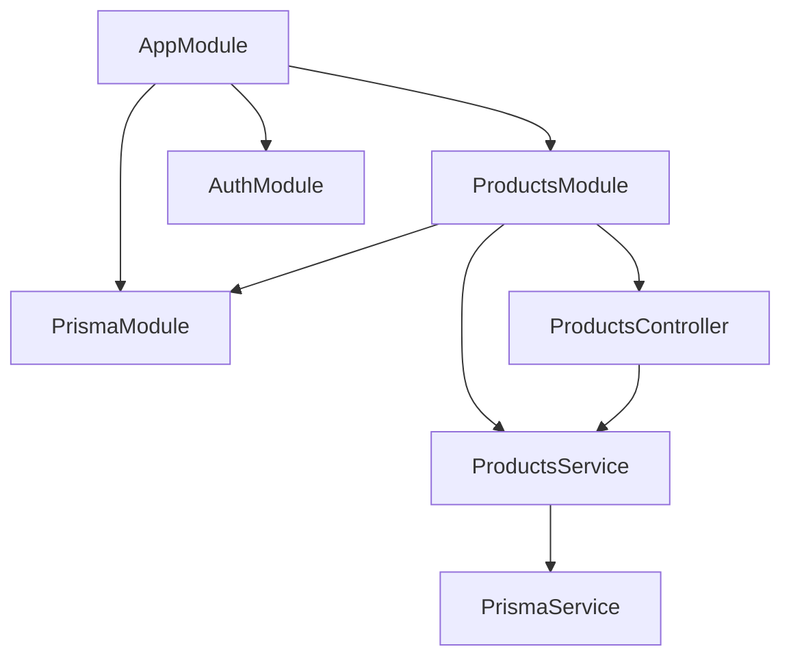
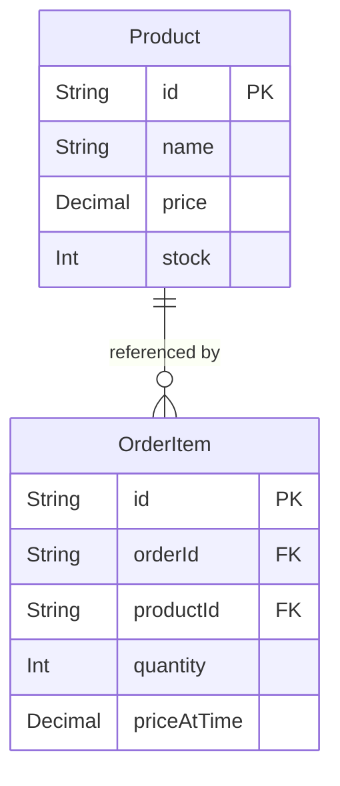
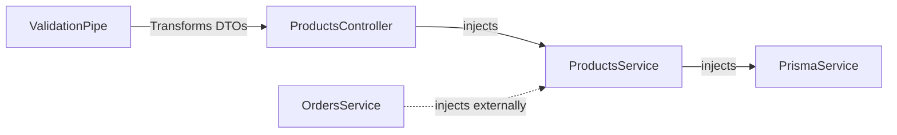
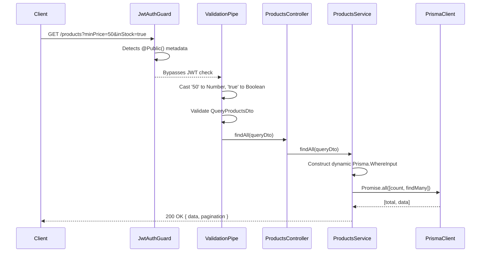
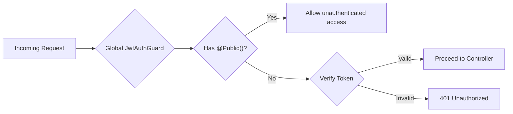

# Products Module — Technical Documentation

> **Project:** NestJS E-Commerce API
> **Module:** `src/products/`
> **Author:** Generated during development session — May 24, 2026
> **Stack:** NestJS 10 · TypeScript 5.9 · Prisma 7 · PostgreSQL · class-transformer

---

## Table of Contents

1. [Overview](https://www.google.com/search?q=%231-overview)
2. [Module Architecture](https://www.google.com/search?q=%232-module-architecture)
3. [File Structure](https://www.google.com/search?q=%233-file-structure)
4. [Database Schema](https://www.google.com/search?q=%234-database-schema)
5. [Dependency Injection Graph](https://www.google.com/search?q=%235-dependency-injection-graph)
6. [API Endpoints](https://www.google.com/search?q=%236-api-endpoints)
7. [Request Lifecycle — GET /products](https://www.google.com/search?q=%237-request-lifecycle--get-products)
8. [High-Performance Querying](https://www.google.com/search?q=%238-high-performance-querying)
9. [Decimal & Type Coercion](https://www.google.com/search?q=%239-decimal--type-coercion)
10. [Error Handling](https://www.google.com/search?q=%2310-error-handling)
11. [Authentication & Authorization](https://www.google.com/search?q=%2311-authentication--authorization)
12. [DTOs & Validation](https://www.google.com/search?q=%2312-dtos--validation)
13. [Integration With Other Modules](https://www.google.com/search?q=%2313-integration-with-other-modules)
14. [Extending the Module](https://www.google.com/search?q=%2314-extending-the-module)
15. [Environment & Configuration](https://www.google.com/search?q=%2315-environment--configuration)

---

## 1. Overview

The Products module is the catalog core of the e-commerce API. It is responsible for:

* Managing the creation, updating, and deletion of inventory items
* Exposing a high-performance, paginated public catalog for unauthenticated users
* Dynamically filtering products based on complex query parameters (price ranges, stock availability, and text search)
* Transforming URL query strings into strict TypeScript types before they hit the business logic
* Acting as the source of truth for product pricing and stock levels for dependent modules (like `Orders`)

---

## 2. Module Architecture



### Why `ProductsService` is exported

The `ProductsModule` explicitly adds `ProductsService` to its `exports` array. Because the catalog dictates stock availability and pricing, transactional modules (like the Orders module) must inject the `ProductsService` to validate data before executing transactions.

---

## 3. File Structure

```text
src/
├── products/
│   ├── dto/
│   │   ├── create-product.dto.ts    # Payload shape for POST
│   │   ├── update-product.dto.ts    # Partial payload for PATCH
│   │   └── query-products.dto.ts    # class-transformer logic for GET queries
│   ├── products.controller.ts       # Route handlers, applies @Public()
│   ├── products.module.ts           # Module declaration, DI wiring, and exports
│   └── products.service.ts          # Business logic and Prisma DB operations
│
├── common/
│   └── decorators/
│       └── public.decorator.ts      # Bypasses the global JWT Guard
│
├── prisma/
│   ├── prisma.module.ts             # Global Prisma module
│   └── prisma.service.ts            # Wraps PrismaClient

```

---

## 4. Database Schema

The Products module primarily interacts with the `Product` model, serving as a heavily referenced entity across the database.



### Field notes

| Field | Type | Notes |
| --- | --- | --- |
| `Product.id` | `String @db.Uuid` | Auto-generated via `gen_random_uuid()` in PostgreSQL |
| `Product.name` | `String` | Indexed for text searching (`mode: 'insensitive'`) |
| `Product.price` | `Decimal @db.Decimal(10,2)` | Base price, safely serialized via Prisma Decimal types |
| `Product.stock` | `Int` | Defaults to `0`. Managed via atomic decrements during order placement |

---

## 5. Dependency Injection Graph



The `ProductsService` strictly encapsulates database interactions. No controller or external service queries the `Product` table directly; they all route through the methods exposed by this service.

---

## 6. API Endpoints

| Method | Path | Auth | Description |
| --- | --- | --- | --- |
| `GET` | `/products` | **Public** | Fetch paginated catalog with dynamic filters |
| `GET` | `/products/:id` | **Public** | Fetch a single product by UUID. Returns 404 if missing |
| `POST` | `/products` | Protected | Create a new product |
| `PATCH` | `/products/:id` | Protected | Update specific product fields |
| `DELETE` | `/products/:id` | Protected | Remove a product from the database |

---

## 7. Request Lifecycle — GET /products



---

## 8. High-Performance Querying

To ensure the public catalog endpoint remains fast under heavy load, the `ProductsService.findAll` method implements concurrent database fetching.

Instead of running the total count query and the data fetch query sequentially (which doubles the database round-trip time), they are executed in parallel:

```typescript
const [total, data] = await Promise.all([
  this.prisma.product.count({ where }),
  this.prisma.product.findMany({
    where,
    skip,
    take: limit,
    orderBy: { name: 'asc' },
  }),
]);

```

### Dynamic Filtering

The `where` clause is built dynamically. Prisma operators are only appended if the client explicitly requested them in the query parameters:

* **Search:** Translates to `{ contains: search, mode: 'insensitive' }`
* **Price Range:** Translates to `{ gte: minPrice, lte: maxPrice }`
* **Stock Status:** Translates to `{ gt: 0 }` (in stock) or `{ equals: 0 }` (out of stock)

---

## 9. Decimal & Type Coercion

### Decimal Serialization Pattern

When performing price calculations or writing Decimal values back to Prisma:

```typescript
    // Reading: Prisma returns Decimal.js objects
    const price = product.price; // Decimal

    // Calculating: Always use Decimal methods, never + operator
    const total = new Decimal(price.toString()).mul(quantity);

    // Writing: Serialize to 2 decimal places before saving
    await this.prisma.product.update({
    where: { id },
    data: {
        price: total.toDecimalPlaces(2).toNumber(), // ✅ Safe
    },
    });

```


### The Network String Problem

Query parameters (e.g., `?limit=10&inStock=true`) arrive at the NestJS router as strings. If passed directly to Prisma, they will cause a type mismatch crash.

### The `class-transformer` Solution

The `QueryProductsDto` utilizes `class-transformer` to intercept these strings before validation:

```typescript
@Type(() => Number) // Coerces '10' to 10
@IsInt()
limit?: number = 10;

@Transform(({ value }) => value === 'true' || value === true) // Coerces 'true' to boolean true
@IsBoolean()
inStock?: boolean;

```

This guarantees the service layer strictly deals with primitives, preventing unexpected runtime database errors.

---

## 10. Error Handling

Standard HTTP exceptions ensure clean client consumption:

| Scenario | Exception | HTTP Status |
| --- | --- | --- |
| UUID format invalid on GET/PATCH/DELETE | `BadRequestException` (from ParseUUIDPipe) | 400 |
| DTO validation failure (e.g., negative price) | `ValidationException` (from ValidationPipe) | 400 |
| Product ID does not exist on GET | `NotFoundException` (thrown by `findOne`) | 404 |
| Attempting to update/delete non-existent ID | `NotFoundException` | 404 |
| Missing JWT on POST/PATCH/DELETE | `UnauthorizedException` (from JwtAuthGuard) | 401 |

---

## 11. Authentication & Authorization

The module employs a hybrid security posture utilizing the application's global `APP_GUARD`.



* **Read Operations:** `GET /products` and `GET /products/:id` are tagged with the `@Public()` decorator.
* **Write Operations:** `POST`, `PATCH`, and `DELETE` intentionally lack the decorator, automatically falling under the strict protection of the global guard.

---

## 12. DTOs & Validation

### CreateProductDto

```typescript
export class CreateProductDto {
  @IsString()
  name: string;

  @IsNumber()
  @Min(0)
  price: number;

  @IsInt()
  @Min(0)
  @IsOptional()
  stock?: number;
}

```

### UpdateProductDto

Leverages `@nestjs/swagger`'s `PartialType()` to automatically inherit validation rules from `CreateProductDto`, making all fields optional for `PATCH` requests without duplicating code.

---

## 13. Integration With Other Modules

### AuthModule

The `ProductsController` relies entirely on the infrastructure provided by the `AuthModule` (specifically the global `JwtAuthGuard` and `@Public()` decorator metadata) for its security.

### PrismaModule

Imports `PrismaModule` to gain access to the singleton `PrismaService` instance, ensuring the Products module shares the same connection pool as the rest of the application.

---

## 14. Extending the Module

### Adding Admin-Only Roles

Currently, any authenticated user can create or delete products. To restrict this, implement a custom `RolesGuard`:

```typescript
@Post()
@Roles('ADMIN') // Custom decorator
@UseGuards(RolesGuard) // Checks req.user.role
create(@Body() createProductDto: CreateProductDto) {
  return this.productsService.create(createProductDto);
}

```

### Mobile POS / Inventory Syncing

To support real-time inventory syncing with external systems (such as a mobile POS), the module can be extended to emit WebSocket events when stock changes:

1. Inject a NestJS Gateway/WebSockets service.
2. Emit a `product.stock.updated` event inside the `update` method, allowing connected POS terminals to automatically refresh their catalog without polling.

---

## 15. Environment & Configuration

The Products module inherits the global environment:

| Variable | Used by | Purpose |
| --- | --- | --- |
| `DATABASE_URL` | `PrismaService` | Resolves the Supabase PostgreSQL connection |

No module-specific environment variables are required.